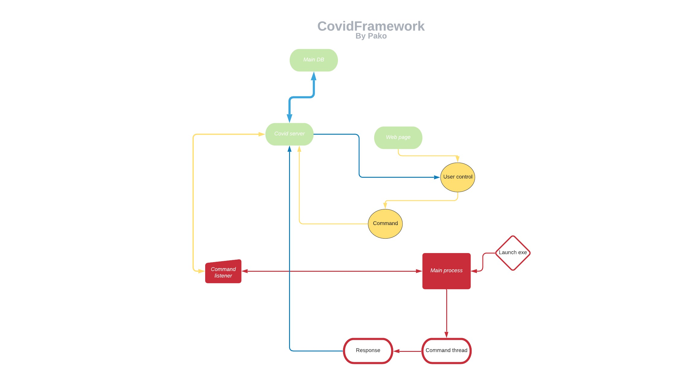

<h1> 
  &nbsp;The Covid Framework&nbsp;

</h1>
&NewLine;
&NewLine;
This project's main goal is to create an exploitation framework and all in one website to maintain an attack.

It provides built in functions in order to execute remote code on a target machine.

The best thing about it, is the visulization of things such as a live location and easy response reading from commands.

Enjoy!

&nbsp;&nbsp;

### Available features

| Command | Description|
| :-- |    :-:   | 
| Wifi passwords| Get all stored wifi passwords | 
| Persistence| Taskscheduler based persistence| 
|Chrome passwords|Get all stored local chrome passwords| 
|Privilege escalation|P.E based onfodehelper| 
|Change background image|Change background of the remote desktop| 
|Upload/Download files|Retrieve or upload files| 
|Interactive powershell|Start interactive powershell command\response| 
|Location|Live location based on wifi routers around, or public IP address|
|Login popup|Prompt login popup for user login credentials|

&nbsp;&nbsp;&nbsp;

### Diagram

&nbsp;&nbsp;&nbsp;

## ScreenShots

### Credits
  All credits to dvbergmann@github.com & pako648@github.com
  
### Contributions and comments
pakoa648@pakoa648@gmail.com 

