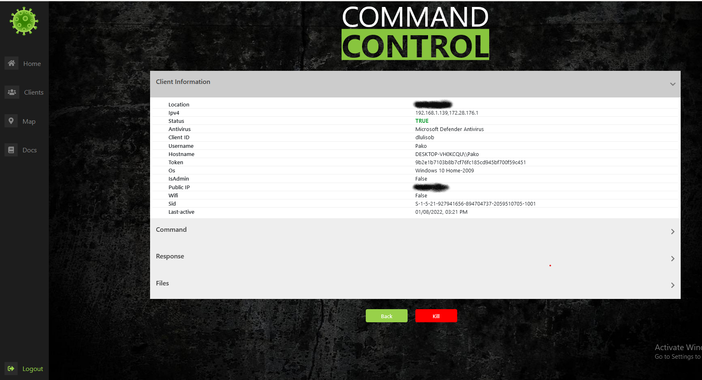

<h1 align="center">
  <br>
  <p align="center"></p>
  <p align="center"></p>
</h1>
<p align="center">

  [](mailto:tomp12@protonmail.com)
  [](https://www.linkedin.com/in/tom-paz-906788226/)
  [](https://twitter.com/tomp332)
  [](https://github.com/tomp332)
</p>

# Table of contents
- [Table of contents](#table-of-contents)
- [About](#about)
- [Setup](#setup)
- [Usage](#usage)
  - [Commands](#commands)
- [Frontend UI ScreenShots](#frontend-ui-screenshots)
- [Contributors](#Contributors)
- [Contact](#contact)
- [Disclaimer](#disclaimer)


# About
This project's main goal is to create an exploitation framework and an all in one website to maintain an exploitation session.
It provides built in functions in order to execute remote code on a target machine. In this project we tried to combine an open-source UI based project with the also the client side being open-source aswell.
With the CovidFramework you can setup your own environment with a full compatible exploitation framework server and client. 

TheCovidFramework has it built with 3 main parts:
##### Covid Server:
  - Express Nodejs server 
  - Grafana in order to inject different iframes to the frontend
##### Covid App:
  - React frontend
  - Nginx in order to serve as a proxy for the React application
##### Covid client:
  - C++ Malware that uses Winapi user mode functions in order to interact and execute all sorts of built in commands.

# Setup
1. Clone project 
```
git clone https://github.com/tomp332/The-Covid-Framework.git

cd The-Covid-Framework/production
```
2. Edit the docker-compose.yml file with your specified port and domain\ip to host the backend services 
  - Get a MongoDB url in order to connect to your specified data storage.
  - Specify your connection url in the docker-compose.yml file:
  ```
        <line 11> - ATLAS_URI_MONGO=<MongoDB url for connection>
  ```
  - Fill in your domain where you would like to host all Covid services:
  ```
        <line 9> - HOST=<Your Server Domain\IP>
        <line 24> - REACT_APP_API_URL=<Your server Domain\IP>
  ```
3. If you would like to generate your own certificates instead of the default ones, generate and overwrite the following files:
  - production/certs/cert.pem - your public key
  - production/certs/privkey.pem - your private key

# Usage

To run all Covid services:
```
cd production

docker-compose up

```

### Commands

| **Command**             | **Description**                                                  |
|-------------------------|------------------------------------------------------------------|
| Wifi Passwords          | Get all stored wifi passwords                                    |
| Persistence             | Taskscheduler based persistence                                  |
| Chrome passwords        | Get all stored local chrome passwords                            |
| Privilege escalation    | P.E based on fodehelper                                          |
| Change background image | Change background of the infected computer                       |
| Upload/Download files   | Retrieve or upload files                                         |
| Location                | Live location based on wifi routers around, or public IP address |
| Login popup             | Prompt login popup for user login credentials                    |
| Webcam picture          | Take a live webcam picture from the infected computer            |
| Chrome browser history  | Get all browser history from Chrome                              |


# Frontend UI ScreenShots
<p align="center"></p>
<p align="center"></p>
<p align="center"></p>
<p align="center"></p>


# Contributors

 - @dvbergmann [David Bergmann](https://github.com/dvbergmann)


# Contact

Feel free to open issues and contact us with any question :+1:

<p align="center">

  [](mailto:tomp12@protonmail.com)
  [](https://www.linkedin.com/in/tom-paz-906788226/)
  [](https://twitter.com/tomp332)
  [](https://github.com/tomp332)
</p>

# Disclaimer

You shall not misuse the information to gain unauthorised access. However, you may try out these hacks on your own computer at your own risk. Performing hack attempts (without permission) on computers that you do not own is illegal.

Enjoy :metal:


